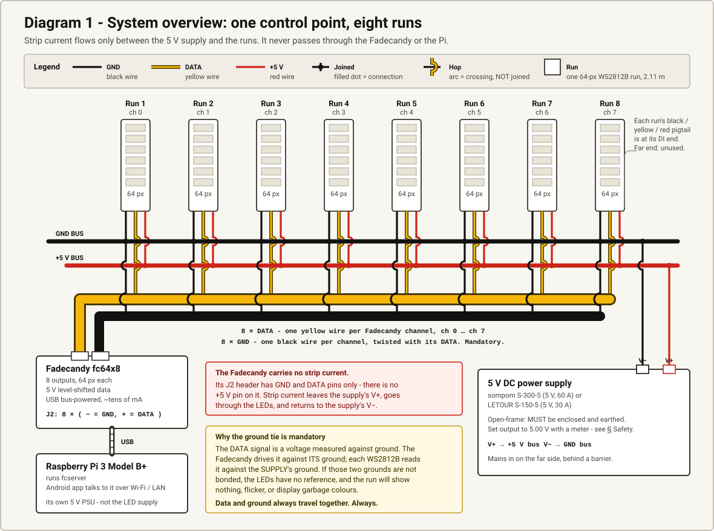
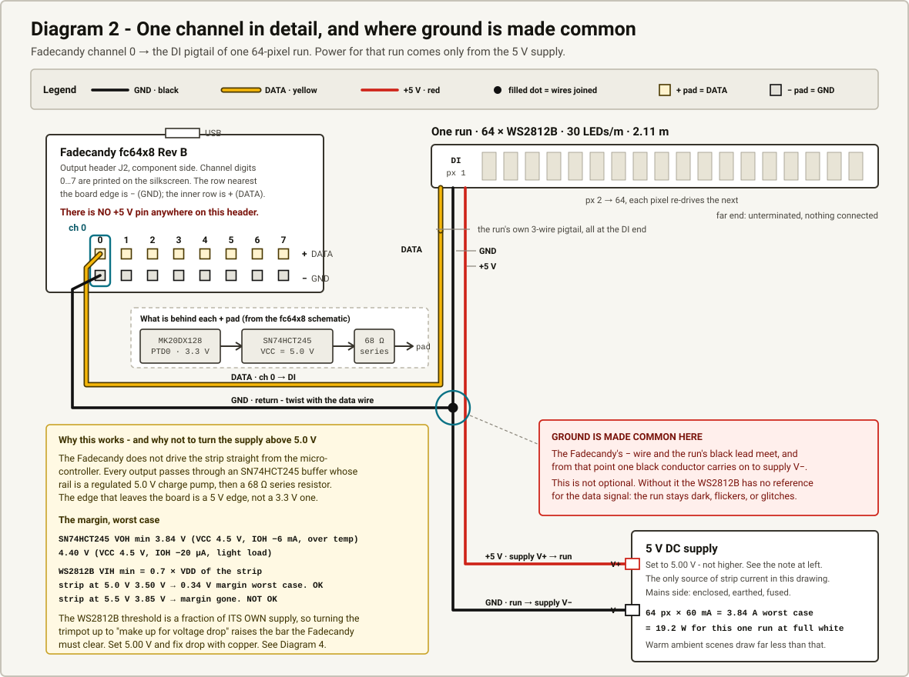
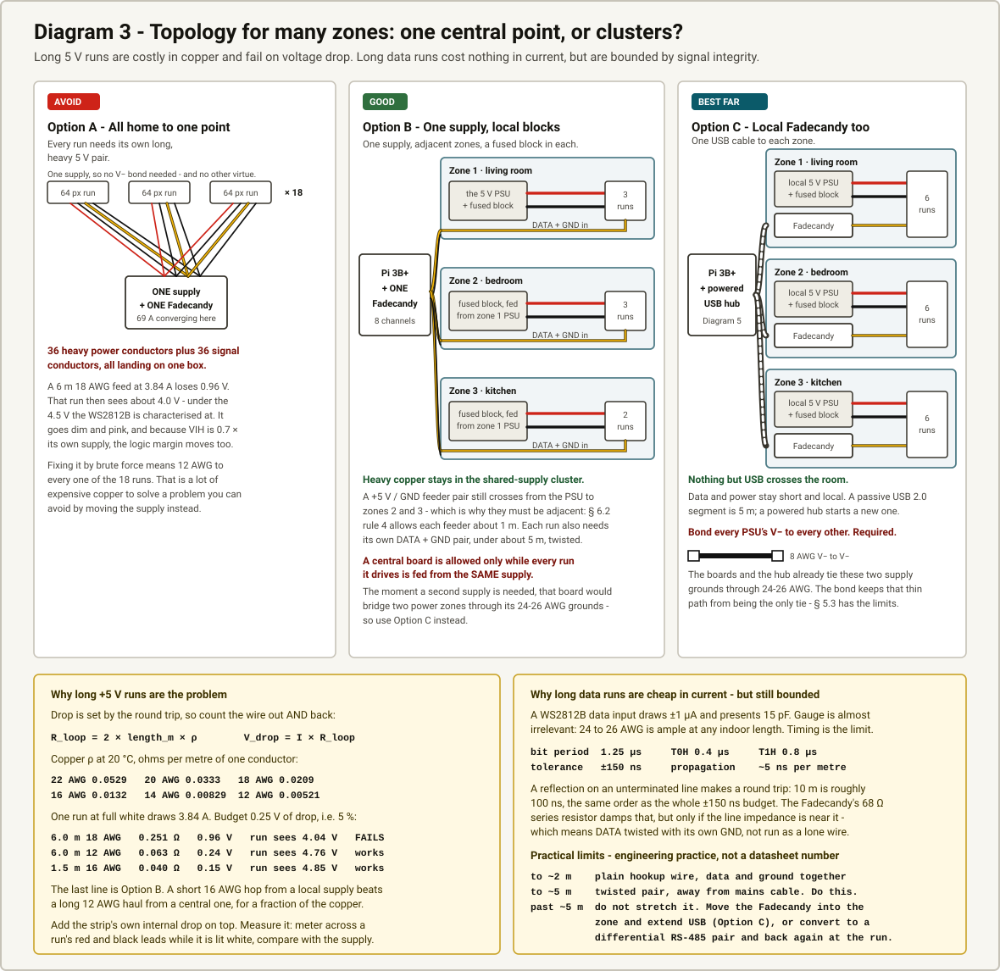
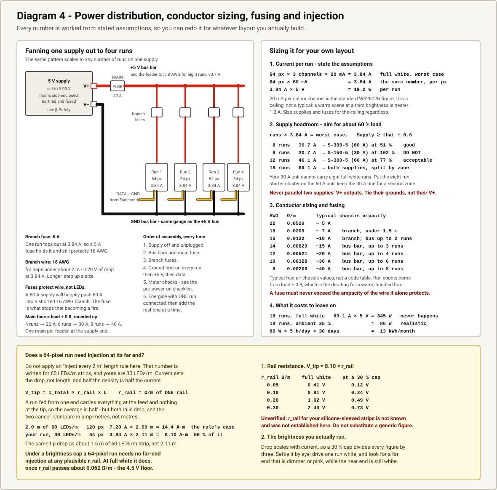
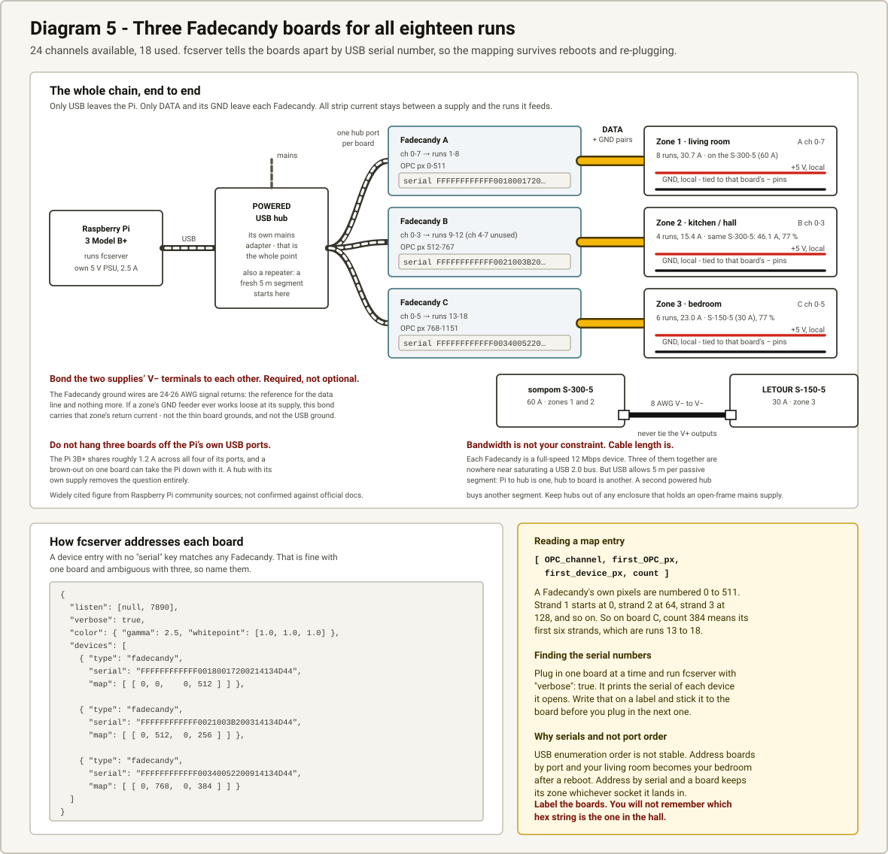

# Wiring

This document is meant to be pulled cable from.
It covers what the Fadecandy's output header actually is, how to get 5 V to the strips without wiring the whole apartment back to one box, how to size conductors and fuses, and what to check with a meter before anything is energised.

Everything electrical here is traced to a primary source, and the sources are listed at the end.
Where something could not be established, it is marked **unverified** rather than smoothed over.

Wire colours throughout the diagrams match the pigtails on your strips: **black = GND, yellow = DATA, red = +5 V**.
Every conductor is also labelled in text, so the diagrams still work printed in grey.

---

## 1. The hardware, as measured

| | |
|---|---|
| Strips | WS2812B in clear silicone sleeving, 33 mm centre to centre, so exactly 30 LEDs/m |
| Run length | 64 LEDs, 2.11 m |
| Topology | Data lands on DI at one end only; the far end is unterminated. Each run is independent, not chained. |
| Pigtail | Black = GND, yellow = DATA, red = +5 V, all at the DI end |
| Quantity | About 18 runs |
| Supplies | LETOUR S-150-5 (5 V, 30 A) and sompom S-300-5 (5 V, 60 A) |
| Controllers | Several Fadecandy boards |
| Host | Raspberry Pi 3 Model B+ |

Because each run is independent rather than chained, 18 runs need 18 data channels, which is why the board count matters.
One Fadecandy gives 8.

---

## 2. What the Fadecandy output header actually is

This section is the one worth reading twice, because the rest depends on it.
It was verified three ways that agree with each other: the Eagle schematic netlist, the Eagle board file's silkscreen and pad geometry, and the firmware's pin assignments.

### 2.1 The header is GND and DATA only. There is no +5 V pin on it.

J2 is a 2 × 8 header labelled `Outputs` in the schematic.
In the netlist, the odd pins (1, 3, 5, 7, 9, 11, 13, 15) are all tied to `GND`.
Each even pin (2, 4, … 16) connects through one 68 Ω series resistor to one output of the buffer.
No pin on J2 touches `+5V`, `+3V3`, or the buffer's supply rail.

In the board file, the silkscreen prints `0` through `7` above the header and a `+` / `−` pair for each channel.
The `−` row is the one nearest the board edge.
The designer's own build guide says the same thing in plain words: *"The GND wire needs to connect to the − terminal on the Fadecandy, and the DIN wire connects to +. There are tiny + and − labels on the board, or you can remember that the pins nearest to the edge are all −."*

**So: strip power cannot come from the Fadecandy.
It must come from the external supply.**
The same guide is explicit that *"The LEDs themselves draw so much power that they need a separate power brick, but the controller board requires very little power."*

The only 5 V rail on the board is the AAT3110-5.0 charge pump that supplies the level shifter.
That part is rated for about 100 mA total, and it is already spoken for.
It is not a power source for anything external.

### 2.2 Channel number to pin, verified end to end

The firmware writes all eight outputs as one byte of PORTD.
`OctoWS2811z.cpp` assigns strip 1 to pin 2, strip 2 to pin 14, strip 3 to pin 7, strip 4 to pin 8, strip 5 to pin 6, strip 6 to pin 20, strip 7 to pin 21, strip 8 to pin 5.
`core_pins.h` maps those to PORTD bits 0, 1, 2, 3, 4, 5, 6, 7 in that order.
The schematic then runs PTD0 through the buffer and its 68 Ω resistor to J2 pin 16, PTD1 to pin 14, and so on down to PTD7 at pin 2.
The board file puts J2 pin 16 at the same x coordinate as the silkscreen `0`, and pin 2 at the silkscreen `7`.

| fcserver channel | silkscreen | firmware "strip" | MCU pin | J2 DATA pin (`+`) | J2 GND pin (`−`) |
|---|---|---|---|---|---|
| 0 | `0` | strip 1 | PTD0 | 16 | 15 |
| 1 | `1` | strip 2 | PTD1 | 14 | 13 |
| 2 | `2` | strip 3 | PTD2 | 12 | 11 |
| 3 | `3` | strip 4 | PTD3 | 10 | 9 |
| 4 | `4` | strip 5 | PTD4 | 8 | 7 |
| 5 | `5` | strip 6 | PTD5 | 6 | 5 |
| 6 | `6` | strip 7 | PTD6 | 4 | 3 |
| 7 | `7` | strip 8 | PTD7 | 2 | 1 |

In practice you do not need the J2 pin numbers.
Read the silkscreen digit, take `+` for data and `−` for ground, and remember the edge row is ground.

### 2.3 The outputs are 5 V, not 3.3 V

The data outputs are level shifted.
The schematic shows an `SN74HCT245PWR` octal buffer whose `VCC` net is the output of an `AAT3110IGU-5.0-T1` regulated charge pump, with `OE` tied to ground and `DIR` tied to that same 5 V rail, so all eight channels are permanently enabled in the A-to-B direction.
Each output then passes through a 68 Ω series resistor before reaching the header.

The upstream `pcb/README.md` states the intent directly: *"The Teensy uses 3.3v IO which doesn't work reliably with the WS2811 LEDs.
Fadecandy includes a level shifter and series termination resistors.
Fadecandy also includes a boost converter power supply to generate a stable 5V for the level shifter even when the USB power is noisy or sagging due to long cables."*

This is a real, verified answer, not an assumption: **the edge that leaves a Fadecandy output is a 5 V edge.**

### 2.4 The logic margin, and why you must not turn the supply above 5.0 V

The WS2812B datasheet gives `VIH` for DIN as **0.7 × VDD** minimum, and `VIL` as 0.3 × VDD maximum, over a characterised supply range of 4.5 V to 5.5 V.
Note what that means: the threshold the Fadecandy must clear is a fraction of *the strip's own supply*, not a fixed voltage.

The TI datasheet for the SN74HCT245 gives, at `VCC` = 4.5 V:

| Condition | `VOH` min |
|---|---|
| `IOH` = −20 µA (light load, which is this case) | 4.40 V |
| `IOH` = −6 mA, over temperature | 3.84 V |

A WS2812B data input draws ±1 µA and presents 15 pF, so the steady-state load is the light-load column; the −6 mA figure is the pessimistic bound during edges into cable capacitance.
The Fadecandy's buffer rail is a regulated 5.0 V charge pump rather than 4.5 V, so the real numbers are better than the table.

Working the margin at the pessimistic end:

```
strip at 5.0 V   VIH = 3.50 V   vs 3.84 V worst-case VOH   margin +0.34 V   OK
strip at 5.5 V   VIH = 3.85 V   vs 3.84 V worst-case VOH   margin  −0.01 V  NOT OK
```

This class of supply normally has an output trim adjustment, usually marked V-ADJ.
The tempting move is to wind it up to "make up for voltage drop in the cable."
Do not.
Raising the strip's supply raises the bar the Fadecandy has to clear, and it eats the margin you were trying to protect.

**Set the supplies to 5.00 V, measured at the supply terminals with a meter, and fix voltage drop with copper instead.**

### 2.5 Ground must be common, and data should be paired with its own ground

The data signal is a voltage measured against ground.
The Fadecandy drives it against its ground; each WS2812B reads it against its own supply's ground.
If those grounds are not bonded, the LEDs have no reference and the run stays dark, flickers, or shows garbage.

The designer's recommended practice is stronger than "bond it somewhere": *"The recommended way of wiring the Fadecandy Controller's ground (GND) wire is to run separate wires from the Fadecandy Controller to your LED strips, and to keep its ground wire paired with its data wire.
Keeping your data wires and power wires separate is good practice for creating reliable projects.
At this small of a scale it isn't a big deal, but this will help a lot with reliability on larger projects."*

That is why J2 gives you eight ground pins rather than one.
Use the ground pin next to the channel you are using, run it alongside that channel's data wire, and land the pair at the run.

---

## 3. Diagram 1 - System overview



The thing to take from this drawing is the current path.
Strip current leaves the supply's V+, goes through the LEDs, and returns to the supply's V−.
It never passes through the Fadecandy or the Pi.
The Fadecandy contributes a data edge and a ground reference and nothing else; it is powered from USB and draws on the order of tens of milliamps.

The Pi has its own 5 V supply.
Do not try to run the Pi from the LED supply, and do not try to run LEDs from the Pi.

---

## 4. Diagram 2 - One channel in detail



Per channel you make exactly three connections at the run end and two at the board end:

1. Fadecandy channel *n* `+` pad → the run's yellow DATA lead.
2. Fadecandy channel *n* `−` pad → the run's black GND lead.
    Twist this with the data wire.
3. The run's black GND lead → the supply's V−.
4. The run's red +5 V lead → the supply's V+, through that run's branch fuse.

Connections 2 and 3 meet at a junction, and that junction is where ground becomes common.
Physically the neatest place for it is the ground terminal of the fused distribution block that serves that run, so the run's ground, the Fadecandy's ground wire, and the supply's V− all land on the same bar.

The diagram also shows what sits behind each `+` pad, since it explains the numbers in §2.4: MK20DX128 PTD*n* at 3.3 V, into the SN74HCT245 buffer at 5.0 V, through a 68 Ω series resistor, out to the pad.

---

## 5. Diagram 3 - Topology: one central point, or clusters?



This is the direct answer to "there will be a lot of wires running around."

### 5.1 Why all-home-to-one-point fails

Voltage drop is set by the round trip, so count the conductor out and back:

```
R_loop = 2 × length_m × ρ          V_drop = I × R_loop
```

Copper resistance at 20 °C, ohms per metre of one conductor:

| AWG | Ω/m | typical chassis-wiring ampacity |
|---|---|---|
| 22 | 0.0529 | ~5 A |
| 20 | 0.0333 | ~6 A |
| 18 | 0.0209 | ~7 A |
| 16 | 0.0132 | ~10 A |
| 14 | 0.00829 | ~15 A |
| 12 | 0.00521 | ~20 A |

Those ampacity figures are typical free-air chassis-wiring values used for sizing equipment wiring, not a building-code table.
Derate them when conductors are bundled, in conduit, or in a warm enclosure.

One run at full white draws 3.84 A (see §7).
Budgeting 0.25 V of drop, which is 5 %:

| Feed | R_loop | Drop at 3.84 A | Run sees | |
|---|---|---|---|---|
| 6.0 m, 18 AWG | 0.251 Ω | 0.96 V | 4.04 V | fails |
| 6.0 m, 12 AWG | 0.063 Ω | 0.24 V | 4.76 V | works |
| 1.5 m, 16 AWG | 0.040 Ω | 0.15 V | 4.85 V | works |

At 4.04 V the run is below the 4.5 V the WS2812B is characterised at.
It goes dim and shifts pink, and because `VIH` is 0.7 × its own supply, the logic threshold moves with it.
Making the first row work by brute force means 12 AWG to all 18 runs.
That is a great deal of expensive copper spent solving a problem you can avoid by moving the supply.

### 5.2 Why long data runs are cheap, and where they stop being cheap

A WS2812B data input draws ±1 µA and presents 15 pF.
Gauge is essentially irrelevant; 24 to 26 AWG is ample at any length you would use indoors.
The constraint is timing, not current.

```
bit period    1.25 µs      T0H 0.4 µs     T1H 0.8 µs
tolerance     ±150 ns      propagation    ~5 ns per metre
```

A reflection on an unterminated line makes a round trip, so 10 m is roughly 100 ns - the same order as the entire ±150 ns budget.
The Fadecandy's 68 Ω series resistor is source termination and damps that reflection, but source termination only works when the line impedance is somewhere near the source impedance.
That means running DATA twisted with its own GND, which gives you a defined pair, rather than running a lone wire whose impedance is whatever the room happens to make it.

Practical limits.
These are engineering practice, not a datasheet number, and are marked as such:

| Distance | What to do |
|---|---|
| up to ~2 m | plain hookup wire, data and its ground kept together |
| up to ~5 m | twisted pair, routed away from mains cable. Do this by default. |
| beyond ~5 m | do not stretch it. Either move the Fadecandy into the zone and extend USB instead, or convert to a differential RS-485 pair and convert back at the run. |

### 5.3 Recommended layout

**Supplies and fused distribution local to each cluster.
Only data and its ground travel any distance.**

Group the runs by room.
Give each group its own 5 V supply and its own fused distribution block, sited within about 1.5 m of the runs it feeds, so the heavy conductors are short and can be 16 AWG rather than 12.

Then pick how the data gets there:

- If the Fadecandy can sit within about 5 m of every run in the cluster, one central Fadecandy is simplest. You run one twisted DATA + GND pair per run.
- If it cannot, put a Fadecandy in the cluster too and run USB to it. Then exactly one cable crosses the room per zone, which is the smallest number of long wires this system can be built with.

Note that if two clusters run from two different supplies and both clusters' grounds return to Fadecandy boards, those supply grounds end up connected.
That is correct and necessary.
What must never happen is paralleling the two supplies' **V+** outputs.
Tie grounds; never tie positives.

---

## 6. Diagram 4 - Power distribution, sizing, fusing and injection



### 6.1 The fan-out pattern

Supply V+ → main fuse → +5 V bus bar → one branch fuse per run → that run's red lead.
Supply V− → GND bus bar → that run's black lead.
Data and its ground arrive separately, from the Fadecandy.

The bus bars carry every run at once, so size them for the cluster total, not for one run: 14 AWG or heavier for a small cluster, 12 AWG for a larger one.
The GND bus is never thinner than the +5 V bus.
All the current that goes out comes back.

### 6.2 Fusing

A fuse protects the **conductor downstream of it**, not the LEDs.
A 60 A supply will happily push 60 A into a shorted 18 AWG branch, and 18 AWG will not survive that.
The fuse is what stops it becoming a fire.

- **Branch fuse, one per run: 5 A.** A run tops out at 3.84 A, so 5 A holds it without nuisance blowing, and 5 A is comfortably inside 18 AWG's ~7 A.
- **Main fuse, one per supply:** size it to the bus bar, not to the supply's rating. A 14 AWG bus bar wants a 15 A main; 12 AWG wants 20 A. If your cluster total exceeds the bus bar's ampacity, the bus bar is too thin, not the fuse too small.
- **Never fuse above the ampacity of the thinnest conductor downstream of that fuse.**

### 6.3 Power injection into the far end

**Do not use an "inject every 2 m" length rule here.**
That number is stated for 60 LEDs/m strips, and these are 30 LEDs/m.
Length on its own is not the variable that causes the problem; current is, and at half the LED density the same length carries half the current.

A run fed from one end carries all of its current at the feed and none at the far tip, so the average current in the strip's own rail is half the total.
That gives the half-length rule for a uniformly loaded strip:

```
V_tip = I_total × r_rail × L        where r_rail = Ω/m of ONE rail inside the strip
```

The product `I_total × L` is what actually sets the drop, so compare in amp-metres rather than metres:

| Case | Pixels | Current | Length | `I × L` |
|---|---|---|---|---|
| 2.0 m of 60 LEDs/m, the case the "2 m" rule is written for | 120 | 7.20 A | 2.00 m | 14.4 A·m |
| **your run: 64 px at 30 LEDs/m** | **64** | **3.84 A** | **2.11 m** | **8.10 A·m** |

Your run sits at 56 % of that threshold, so roughly 1.8× margin against it.
Put another way, a 2.11 m run at 30 LEDs/m produces the same tip drop as about a 1.5 m run of 60 LEDs/m strip, not a 2.11 m one.
Crossing 2 m in length is not, by itself, the thing that matters.

**So: a single 64-pixel run at 30 LEDs/m does not need far-end injection.**
That said, 1.8× is a real margin but not a wide one, so the honest answer is that it is comfortable rather than clear-cut, and two things decide it.

**Deciding factor 1: the rail resistance of your strips.**
Substituting your numbers, `V_tip = 8.10 × r_rail`:

| `r_rail` (Ω/m, one rail) | `V_tip` at full white | at a 30 % brightness cap |
|---|---|---|
| 0.05 | 0.41 V | 0.12 V |
| 0.10 | 0.81 V | 0.24 V |
| 0.15 | 1.22 V | 0.36 V |
| 0.20 | 1.62 V | 0.49 V |
| 0.30 | 2.43 V | 0.73 V |

> **Unverified:** `r_rail` for your specific silicone-sleeved strips is not known and was not established for this document. It depends on how that particular strip was built, and these were cut and sleeved by a previous owner. Do not substitute a generic figure.

**Deciding factor 2: the brightness you actually run.**
The drop scales linearly with current, so a 30 % brightness cap divides every number in that table by a little over three.
Read down the right-hand column: even at a fairly poor 0.30 Ω/m rail, a capped run stays under 0.75 V, and at any plausible rail resistance it stays inside a 5 % budget.

Since this is ambient apartment lighting rather than a display piece, the right-hand column is the one you will live in.

**Settle it by measurement, not by argument.**
Drive one run at full white and look along it.
If the far end is visibly dimmer, or has drifted pink or amber while the near end is still white, `r_rail` is at the high end of that table and the drop matters at full white.
If it looks even, it does not.
Then repeat at the brightness you actually intend to use, because that is the case that has to be right.

If it does turn out to need injection, note the practical obstacle: your runs have pads at the DI end only and an unterminated far end, so injecting means opening the silicone sleeve to reach the rails.
Before cutting into a sleeve, try the brightness cap.
At 30 % a run draws about 1.2 A, the drop falls with it, and 30 % of 64 WS2812Bs is already a lot of light for a room.

---

## 7. Current and cable arithmetic you can reuse

State the assumptions, not just the results.

**Assumptions.** Each WS2812B contains three LED dies driven by internal constant-current sinks at a nominal 20 mA per colour channel, so a pixel at full-scale white draws about 60 mA. This is the standard figure used for sizing NeoPixel-class installations.
It is a ceiling: it assumes all three channels at 255 simultaneously, on every pixel, at once.

```
per pixel      3 × 20 mA                    = 60 mA
per run        64 px × 60 mA                = 3.84 A
per run        3.84 A × 5 V                 = 19.2 W
8 runs         8 × 3.84 A                   = 30.7 A   = 154 W
12 runs        12 × 3.84 A                  = 46.1 A   = 230 W
18 runs        18 × 3.84 A                  = 69.1 A   = 345 W
```

**Supply headroom.** Aim for roughly 60 % of the supply's rating at worst case.
Switching supplies run coolest and last longest around half to two-thirds load, and it leaves margin for inrush.

| Runs | Worst case | On the S-150-5 (30 A) | On the S-300-5 (60 A) |
|---|---|---|---|
| 8 | 30.7 A | 102 % - **do not** | 51 % - good |
| 12 | 46.1 A | over - no | 77 % - acceptable |
| 18 | 69.1 A | over - no | over - split across both supplies by zone |

Note the first row: **your 30 A supply cannot carry eight full-white runs.**
Put the eight-run starter cluster on the 60 A unit and keep the 30 A unit for a second zone.

**What it costs to run.** You asked about the electric bill, so:

```
18 runs at full white       345 W      this never actually happens
18 runs, ambient at ~25 %   ~86 W      realistic for warm indirect light
86 W × 5 h/day × 30 days    ~13 kWh/month
```

At a typical US residential rate that is a couple of dollars a month.
The thing worth watching is idle draw: a WS2812B pulls roughly a milliamp even when all three channels are zero, so 1152 pixels sitting "off" is on the order of 1 A, or about 6 W, plus the supplies' own no-load loss.
Put the supplies behind a switch or a smart plug, and the standby cost goes away.

*(The per-pixel quiescent figure is approximate and is not from the datasheet excerpt used here; treat ~6 W standby as an estimate, and measure it once you have a cluster built.)*

---

## 8. Diagram 5 - Multi-board expansion



18 runs needs 18 channels, so three boards: 24 channels available, 18 used.

**Use a powered hub.** Do not hang three boards off the Pi's own ports.
The Pi 3B+ shares roughly 1.2 A across all four of its USB ports - a figure that is widely cited in Raspberry Pi community sources but which was **not confirmed against official Raspberry Pi documentation** for this document.
The recommendation does not depend on the exact number: a hub with its own supply removes the question entirely, and it keeps a brown-out on one board from taking the Pi down with it.

**Bandwidth is not your constraint.** Each Fadecandy is a full-speed 12 Mbps USB device.
Three of them together are nowhere near saturating a USB 2.0 bus.
Cable length is the constraint: 5 m per passive segment, and a powered hub starts a fresh segment.

### 8.1 How fcserver addresses each board

A device entry with no `serial` key matches any Fadecandy.
That is fine with one board and ambiguous with three, so name them:

```json
{
  "listen": [null, 7890],
  "verbose": true,
  "color": { "gamma": 2.5, "whitepoint": [1.0, 1.0, 1.0] },
  "devices": [
    { "type": "fadecandy",
      "serial": "FFFFFFFFFFFF00180017200214134D44",
      "map": [ [ 0, 0,    0, 512 ] ] },

    { "type": "fadecandy",
      "serial": "FFFFFFFFFFFF0021003B200314134D44",
      "map": [ [ 0, 512,  0, 512 ] ] },

    { "type": "fadecandy",
      "serial": "FFFFFFFFFFFF00340052200914134D44",
      "map": [ [ 0, 1024, 0, 128 ] ] }
  ]
}
```

The serials above are examples taken from the upstream documentation.
Yours will differ.

A map entry is `[ OPC_channel, first_OPC_pixel, first_device_pixel, count ]`.
A Fadecandy's own pixels are numbered 0 through 511: strand 1 starts at index 0, strand 2 at 64, strand 3 at 128, and so on.
So `count: 128` on board C means its first two strands, which are runs 17 and 18.

**Finding the serials.** Plug in one board at a time and run `fcserver` with `"verbose": true`.
It prints the serial of each device it opens.
Write it on a label, stick it to that board, and only then plug in the next one.

**Why serials and not port order.** USB enumeration order is not stable.
Address boards by port and your living room becomes your bedroom after a reboot.
Address by serial and a board keeps its zone whichever socket it lands in.

> `"listen": [null, 7890]` makes fcserver reachable from other machines on your network, which is what the Android app needs. Upstream warns that fcserver has no built-in security: anyone who can reach that port controls the lights. Keep it on your own LAN, not exposed to the internet.

---

## 9. A worked example for the apartment

### 9.1 Start here: 8 runs, one board, one supply

This is a sensible first installation.
It is a complete, working system, and it is also the first cluster of the full build, so nothing is wasted if you expand.

| | |
|---|---|
| Runs | 8, one per Fadecandy channel 0-7 |
| Pixels | 512 |
| Worst-case current | 30.7 A |
| Supply | **sompom S-300-5 (60 A)** - 51 % loaded, comfortable |
| Bus bars | 14 AWG, or 12 AWG if the block sits more than a metre from the supply |
| Main fuse | 15 A on a 14 AWG bus |
| Branch fuses | 5 A per run, 8 of them |
| Branch wire | 18 AWG, under 2 m per run |
| Data | 8 × twisted DATA + GND pairs, 24-26 AWG, each under 5 m |
| Host | Pi 3B+, its own 5 V 2.5 A supply, one USB cable to the board |

Note the supply choice: the 30 A unit would be at 102 % of rating here.
Use the 60 A unit for this cluster.

### 9.2 Expansion path: 18 runs, three boards, both supplies

18 runs at full white is 69.1 A, and your two supplies total 90 A, so it fits.
The binding constraint is the 30 A unit: at the 60 % target it wants 4 runs, and 6 runs (23.0 A, 77 %) is about as far as it should be pushed.

The version that fits the two supplies you already own:

| Supply | Runs | Worst case | Load |
|---|---|---|---|
| S-300-5 (60 A) | 12 | 46.1 A | 77 % |
| S-150-5 (30 A) | 6 | 23.0 A | 77 % |

Mapped onto rooms and boards:

| Zone | Runs | Worst case | Supply | Board and channels |
|---|---|---|---|---|
| Living room | 8 | 30.7 A | S-300-5 | Fadecandy A, ch 0-7 |
| Kitchen / hall | 4 | 15.4 A | S-300-5, same unit | Fadecandy B, ch 0-3 |
| Bedroom | 6 | 23.0 A | S-150-5 | Fadecandy B ch 4-7, Fadecandy C ch 0-1 |

Two things about that table are worth calling out.

First, the board split does not line up with the supply split, and that is fine.
Data channels and power zones are independent.
A Fadecandy's eight channels can feed runs on two different supplies, as long as each of those runs has its ground bonded back to that board.

Second, living room and kitchen/hall share one supply, which only respects the clustering rule in §5.3 if those two areas are adjacent enough for the distribution block to sit within a metre or two of both.
If they are not, that shared supply is exactly the long-power-run mistake §5.1 warns about.

Both supplies at 77 % is workable but not generous, and the shared-supply compromise above exists only because you have two supplies for three zones.
A third 5 V supply, one per zone, removes both problems at once: every supply lands under 60 %, and every supply is genuinely local to the runs it feeds.
That is cheaper than rewiring for heavier bus bars, and it is the layout §5.3 actually recommends.

Keep each supply physically inside the cluster it serves, and tie all the grounds together.

---

## 10. Safety

The two supplies you have are open-frame units.
Their mains terminals are exposed screw terminals on an uninsulated board.
They are components intended to be built into equipment, not appliances.
Treat them accordingly.

**Enclosure.** Each supply goes in a closed enclosure before it is ever plugged in.
No exposed mains terminals, ever, not even "just for testing."
A metal or flame-rated plastic box, with the supply's mains end behind a barrier or a terminal cover, and cable glands or strain relief where the leads enter and leave.

**Earthing.** These are Class I supplies with an earth terminal, marked with the earth symbol.
The mains earth conductor lands on that terminal, and if the enclosure is metal, the enclosure is bonded to it too.
Do not run them from a two-wire cord with the earth left off.
If a live conductor works loose inside an unearthed metal box, the box becomes live and nothing trips.

**Mains fusing and switching.** Feed each supply through a fused inlet or an in-line fuse sized from the supply's own AC input rating, which is printed on its label - read the label rather than calculating it.
Put a switch on the mains side so the whole installation can be isolated without unplugging anything.

**Strain relief.** Mains conductors must not be able to move if a cable is tugged.
Anchor the mains cable at the enclosure wall so any pull is taken by the gland, not by the screw terminals.

**Separation.** Keep mains wiring physically separated from the 5 V and data wiring inside any shared enclosure - separate compartments or a barrier, different cable entries, and never in the same bundle.
This is a safety requirement first; the reduced noise on the data lines is a bonus.

**Polarity.** Confirm V+ and V− with a meter before connecting a single strip.
WS2812Bs do have some reverse-connection tolerance, but do not spend it.

**Heat.** These supplies are convection or fan cooled.
Do not seal one into an unventilated box, and do not mount it face-down against insulation.
A supply at 77 % load in a warm cupboard runs hot; that is the case where derating the wire ampacity in §5.1 actually matters.

**If any of the above is outside what you are comfortable doing, have the mains side done by an electrician.** The 5 V side is harmless to you and you can build all of it yourself.
The mains side is the part that can kill someone, and it is a small job for someone who does it every day.

---

## 11. Pre-power-on checklist

Do this with the supply **unplugged from the mains** unless a step says otherwise.
You need a multimeter.

**Before any power at all**

1. Visually inspect every mains-side connection.
    No stray strands, no exposed copper past the terminal, no conductor that can move.
    Earth is landed on the earth terminal.
2. Enclosure is closed.
    Cable entries are strain-relieved.
3. Set the meter to continuity.
    Confirm **no continuity between the +5 V bus and the GND bus** with everything connected.
    If it beeps, you have a short - find it now.
4. Confirm continuity from the GND bus to every run's black lead, and to the Fadecandy's `−` pins for the channels in use.
    This is the common ground; prove it exists.
5. Confirm continuity from the +5 V bus, through each branch fuse, to that run's red lead.
    Do this per branch; it also confirms each fuse is actually seated.
6. Confirm **no continuity between the +5 V bus and mains earth**, and none between the GND bus and any mains conductor.
7. Confirm the DATA wire for each channel is on the `+` pad and its ground on the `−` pad of the same channel, and that no data wire is touching a neighbouring pad.
    The pads are 2.54 mm apart and solder bridges there are easy to make and easy to miss.

**Supply alone, no strips connected**

8. Disconnect the +5 V bus from the supply's V+ terminal.
    Plug in and switch on.
9. Meter on DC volts across the supply's V+ and V− terminals.
    You should read close to 5 V, right polarity.
10. Adjust the V-ADJ trimpot until it reads **5.00 V**.
    Not 5.2, not 5.3, for the reason in §2.4.
    If your unit has no adjustment, confirm it reads between 4.90 and 5.10 V and carry on.
11. Switch off and unplug.
    Reconnect the +5 V bus.

**First light, one run**

12. Connect exactly **one** run: its red, its black, and its data pair.
    Leave the other branch fuses out.
13. Power on.
    Meter on DC volts at that run's red and black leads at the strip end.
    With the run dark you should read essentially the supply voltage.
14. Drive that run at full white.
    Re-measure at the strip end.
    The difference from the supply terminals is your actual voltage drop in that branch.
    If it exceeds about 0.25 V, the branch wire is too thin or too long - fix that before adding more runs.
15. Look along the run.
    Even brightness end to end means no injection needed (§6.3).

**Adding the rest**

16. Power off, add one more run, power on, check it, repeat.
    Adding them one at a time means that when something is wrong you already know which connection you just made.
17. With all runs on the cluster connected, drive everything white briefly and check the supply is not going into current limit and is not getting hot.
18. Leave it running a scene for an hour and come back and feel the supply, the bus bars, and the branch wires.
    Nothing should be more than mildly warm.
    Anything hot is undersized.

---

## 12. Sources

Hardware facts in §2 were verified against these, not from recollection:

| Fact | Source |
|---|---|
| J2 is a 2×8 header; odd pins GND, even pins data via 68 Ω; no +5 V pin on it | `pcb/fc64x8/fc64x8.sch`, Eagle schematic netlist (nets `GND`, `N$31`-`N$38`, parts `J2`, `R4`-`R11`) |
| Level shifter is an SN74HCT245 running from an AAT3110-5.0 charge pump; `OE` grounded, `DIR` to 5 V | Same schematic, parts `U3`, `U2`, net `N$27` |
| Silkscreen prints channels 0-7; the `−` row is nearest the board edge; pad geometry per channel | `pcb/fc64x8/fc64x8.brd`, Eagle board file, layers 21/22 text and package `2X08` pad coordinates |
| Firmware channel order: strip 1 = PTD0 … strip 8 = PTD7 | `firmware/OctoWS2811z.cpp` and `firmware/core_pins.h` |
| Design intent: level shifter and series termination present because 3.3 V is unreliable with WS2811; boost converter gives the shifter a stable 5 V | Upstream `pcb/README.md` |
| Strip power comes from a separate brick, not the board; `+`/`−` pad convention; edge row is `−`; ground wire paired with the data wire | *LED Art with Fadecandy*, Micah Elizabeth Scott, published by Adafruit |
| WS2812B `VIH` = 0.7 × VDD, `VIL` = 0.3 × VDD, `VDD` characterised 4.5-5.5 V, input current ±1 µA, input capacitance 15 pF, `T0H`/`T1H`/tolerance | WS2812B datasheet (Adafruit-hosted copy) |
| SN74HCT245 `VOH` min 4.40 V at −20 µA and 3.84 V at −6 mA, both at `VCC` 4.5 V | Texas Instruments SN74HCT245 datasheet |
| AAT3110 charge pump delivers up to about 100 mA | Skyworks / AnalogicTech AAT3110 datasheet |
| fcserver device addressing by `serial`; map entry format; device pixel numbering 0-511 with strands at 64-pixel boundaries; warning about running on untrusted networks | Upstream `doc/fc_server_config.md` |

Upstream repository files were read from the `PimentNoir/fadecandy` mirror of `scanlime/fadecandy`, because the original `scanlime/fadecandy` repository returned 404 at the time of writing.
The mirror's `pcb/README.md` still links back to `scanlime/fadecandy` paths, and its file contents are consistent with the published board.

Explicitly **not** verified, and flagged where it appears:

- The rail resistance of these specific silicone-sleeved strips (§6.3).
- The Pi 3B+ total USB port current limit of 1.2 A - widely cited in Raspberry Pi community sources, not confirmed against official documentation here (§8).
- WS2812B per-pixel quiescent current, used only for the standby estimate in §7.
- Conductor ampacity figures in §5.1 are typical chassis-wiring values for equipment sizing, not a building-code table.
